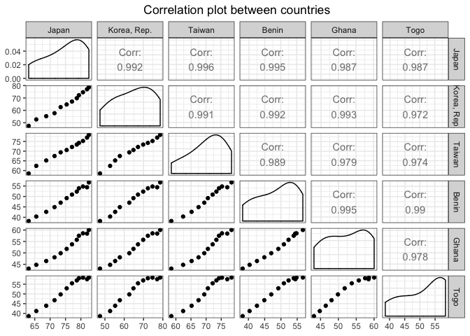
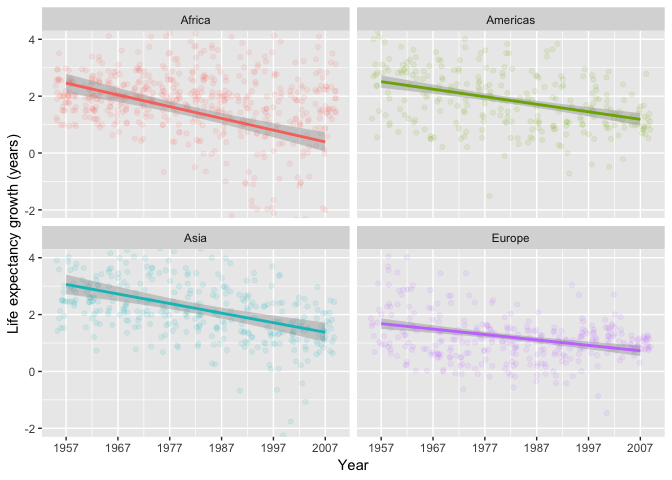

Homework 04: Tidy data and joins
================
Roger Yu-Hsiang Lo
2018-10-09

-   [Bring rectangular data in](#bring-rectangular-data-in)
-   [Data reshaping](#data-reshaping)
-   [Data join](#data-join)

Bring rectangular data in
-------------------------

-   Load the `Gapminder`, `tidyverse`, and `GGally`:

``` r
#install.packages("GGally")
library(gapminder)
library(tidyverse)
library(GGally)
```

-   Some sanity check to make sure the `Gapminder` data was loaded properly:

``` r
head(gapminder) %>%
  knitr::kable(.)
```

| country     | continent |  year|  lifeExp|       pop|  gdpPercap|
|:------------|:----------|-----:|--------:|---------:|----------:|
| Afghanistan | Asia      |  1952|   28.801|   8425333|   779.4453|
| Afghanistan | Asia      |  1957|   30.332|   9240934|   820.8530|
| Afghanistan | Asia      |  1962|   31.997|  10267083|   853.1007|
| Afghanistan | Asia      |  1967|   34.020|  11537966|   836.1971|
| Afghanistan | Asia      |  1972|   36.088|  13079460|   739.9811|
| Afghanistan | Asia      |  1977|   38.438|  14880372|   786.1134|

Data reshaping
--------------

### Life expectancy from a few countries over the years

The life expectancy of three Asian countries (i.e., Japan, South Korea, and Taiwan) and three African countries (i.e., Benin, Ghana, and Togo) over the years is tabulated below:

``` r
gapminder %>%
  filter(country %in% c("Japan", "Korea, Rep.", "Taiwan", "Benin", "Ghana", "Togo")) %>%
  select(country, year, lifeExp) %>%
  spread(key = country, value = lifeExp) %>%
  select(year, "Japan", "Korea, Rep.", "Taiwan", "Benin", "Ghana", "Togo") %>%  # Reorder the columns
  knitr::kable()
```

|  year|   Japan|  Korea, Rep.|  Taiwan|   Benin|   Ghana|    Togo|
|-----:|-------:|------------:|-------:|-------:|-------:|-------:|
|  1952|  63.030|       47.453|   58.50|  38.223|  43.149|  38.596|
|  1957|  65.500|       52.681|   62.40|  40.358|  44.779|  41.208|
|  1962|  68.730|       55.292|   65.20|  42.618|  46.452|  43.922|
|  1967|  71.430|       57.716|   67.50|  44.885|  48.072|  46.769|
|  1972|  73.420|       62.612|   69.39|  47.014|  49.875|  49.759|
|  1977|  75.380|       64.766|   70.59|  49.190|  51.756|  52.887|
|  1982|  77.110|       67.123|   72.16|  50.904|  53.744|  55.471|
|  1987|  78.670|       69.810|   73.40|  52.337|  55.729|  56.941|
|  1992|  79.360|       72.244|   74.26|  53.919|  57.501|  58.061|
|  1997|  80.690|       74.647|   75.25|  54.777|  58.556|  58.390|
|  2002|  82.000|       77.045|   76.99|  54.406|  58.453|  57.561|
|  2007|  82.603|       78.623|   78.40|  56.728|  60.022|  58.420|

We can see the correlation of life expectancy between different countries by using a correlation plot:

``` r
gapminder %>%
  filter(country %in% c("Japan", "Korea, Rep.", "Taiwan", "Benin", "Ghana", "Togo")) %>%
  select(country, year, lifeExp) %>%
  spread(key = country, value = lifeExp) %>%
  select(year, "Japan", "Korea, Rep.", "Taiwan", "Benin", "Ghana", "Togo") %>%
  ggpairs(data = ., columns = 2:7) + theme_bw()
```



As shown in the plot, life expectancy over the years is highly correlated across different countries, even countries in different continents.

### Life expectancy growth in different continents

Let us compare the five-year growth in life expectancy (since the data were sampled every five years) in different continents.

``` r
gapminder %>%
  group_by(country) %>%
  mutate(growth_lifeExp = lifeExp - lag(lifeExp)) %>%  # Calculate the growth compared to the previous year
  filter(year != 1952, continent != "Oceania") %>%  # Remove NA values and data from Oceania
  ungroup() %>%
  group_by(year, continent) %>%
  summarize(mdn_grt_lifeExp = median(growth_lifeExp)) %>%  # Calculate the median
  spread(key = continent, value = mdn_grt_lifeExp) %>%
  knitr::kable(.)
```

|  year|  Africa|  Americas|   Asia|  Europe|
|-----:|-------:|---------:|------:|-------:|
|  1957|  2.0175|     2.819|  2.782|  1.9300|
|  1962|  2.0025|     2.816|  2.575|  1.5650|
|  1967|  1.9920|     2.100|  2.700|  0.9750|
|  1972|  2.0920|     2.118|  2.501|  0.7800|
|  1977|  2.0545|     2.157|  2.246|  1.2650|
|  1982|  1.9910|     1.791|  2.115|  0.9300|
|  1987|  1.8925|     1.633|  2.087|  0.8735|
|  1992|  1.1700|     1.094|  1.851|  0.8450|
|  1997|  0.9245|     1.547|  1.370|  1.1665|
|  2002|  1.0135|     1.199|  1.409|  1.2515|
|  2007|  1.5625|     1.077|  1.410|  0.9375|

We can already see a rough trend from the table: the growth in life expectancy decreased slightly over the years across continents. The trend becomes more "visible" when the data are plotted.

``` r
gapminder %>%
  group_by(country) %>%
  mutate(growth_lifeExp = lifeExp - lag(lifeExp)) %>%  # Calculate the growth compared to the previous year
  filter(year != 1952, continent != "Oceania") %>%  # Remove NA values and data from Oceania
  ungroup() %>%
  group_by(year, continent) %>%
  ggplot(aes(x = year, y = growth_lifeExp, color = continent)) +
  facet_wrap(~continent) + 
  geom_jitter(alpha = 0.1) +
  geom_smooth(method = "lm") +  # Fit regression lines
  scale_x_continuous(breaks = seq(1957, 2007, 10)) +
  coord_cartesian(ylim=c(-2, 4)) +
  labs(x = 'Year', y = 'Life expectancy growth (years)') +
  theme(legend.position = "none")
```



As shown in the plot, the growth in life expectancy decreased gradually across the four continents. We can also see some differences between continents. Around 1960, the growth is biggest in Asia and smallest in Europe. In addition, there is quite some variation in Africa, compared with Europe or Americas in general, as indicated by the width of the gray ribbons.

Data join
---------
